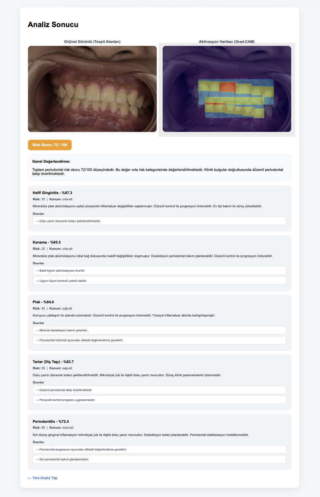

# 🦷 Dental AI — Periodontal Hastalık Tespit Sistemi

> YOLOv8 tabanlı görüntü analizi ve özel eğitilmiş Transformer (LLM) entegrasyonu ile diş eti hastalıklarını tespit eden, klinik değerlendirme raporları üreten yapay zeka sistemi.


[](https://huggingface.co/Kutay0/dis-eti-ai)
[](https://data.mendeley.com/datasets/3253gj88rr/1)

---

## 🖼️ Uygulama Ekran Görüntüsü



---

## 📌 Proje Hakkında

Bu sistem iki ana bileşenden oluşmaktadır:

- **Vision Katmanı (YOLOv8m):** Diş eti fotoğraflarında 7 farklı durumu tespit eder  
- **LLM Katmanı (Custom Transformer):** Tespit sonuçlarını klinik dil ile yorumlar

### Tespit Edilen Sınıflar

| Sınıf | Açıklama | Risk |
|-------|----------|------|
| Sağlıklı Doku | Normal diş eti | Düşük |
| Hafif Gingivitis | Erken evre iltihaplanma | Düşük |
| İleri Gingivitis | İleri evre iltihaplanma | Orta |
| Periodontitis | Periodontal kemik kaybı | Yüksek |
| Plak | Bakteriyel biyofilm | Düşük-Orta |
| Tartar (Diş Taşı) | Mineralize plak | Orta |
| Kanama | Gingival kanama | Orta |

### Model Performansı (V5)

| Metrik | V4 (Eski) | V5 (Yeni) | İyileşme |
|--------|-----------|-----------|----------|
| mAP@50 | 0.546 | **0.908** | +%66 |
| Precision | 0.537 | **0.872** | +%62 |
| Recall | 0.651 | **0.879** | +%35 |
| mAP@50-95 | 0.372 | **0.768** | +%106 |

---

## 🚀 Kurulum

### Gereksinimler

- Python 3.10+
- CUDA destekli GPU (önerilir) veya CPU
- 8GB+ RAM

### 1) Repoyu klonla

```bash
git clone https://github.com/BerkeKutay/dis-eti-ai.git
cd dis-eti-ai
```

### 2) Sanal ortam oluştur

```bash
conda create -n dental_gpu python=3.10
conda activate dental_gpu
```

veya venv ile:

```bash
python -m venv venv
source venv/bin/activate  # Linux/Mac
venv\Scripts\activate     # Windows
```

### 3) Bağımlılıkları yükle

```bash
pip install -r requirements.txt
```

---

## 📦 Model Dosyalarını İndir

Model ağırlıkları **Hugging Face**'de barındırılmaktadır: [](https://huggingface.co/Kutay0/dis-eti-ai)

### Otomatik İndirme (Önerilir)

```bash
pip install huggingface_hub
python3 download_models.py
```

### Manuel İndirme

[Hugging Face model sayfasına](https://huggingface.co/Kutay0/dis-eti-ai) git, dosyaları indir ve şu konumlara yerleştir:

```
dis-eti-ai/
├── runs/detect/dental_strong_m_v5/weights/best.pt
└── dental_llm_project/trained_model/dental_model.pt
```

---

## 🖥️ Uygulamayı Çalıştır

```bash
python app.py
```

Tarayıcıda aç: `http://127.0.0.1:5000`

---

## 💡 Örnek Kullanım

1. Ana sayfada **"Fotoğraf Yükle"** butonuna tıkla
2. Ağız içi diş fotoğrafı seç (`.jpg`, `.png`)
3. **"Analiz Et"** butonuna bas
4. Sistem otomatik olarak şunları üretir:
   - Tespit edilen hastalık sınıfları ve güven skorları
   - Her bölge için risk skoru (0–100)
   - Grad-CAM aktivasyon haritası
   - LLM tarafından üretilen klinik değerlendirme ve öneriler
   - Genel periodontal risk skoru

> **Not:** En iyi sonuç için iyi aydınlatılmış, net ağız içi fotoğraflar kullanın.

---

## 📂 Dataset

Bu projede kullanılan dataset:

**A Dental Intraoral Image Dataset of Gingivitis for Image Captioning**  
Duy Hoang Bao — Hanoi Medical University  
📎 [Mendeley Data — DOI: 10.17632/3253gj88rr.1](https://data.mendeley.com/datasets/3253gj88rr/1)  
📄 Lisans: CC BY 4.0

> 1.096 yüksek çözünürlüklü ağız içi görüntü, her biri periodontist tarafından etiketlenmiş. Eğitim, doğrulama ve test setlerine ayrılmış. Toplam boyut: 6.1 GB.

Dataset indirildikten sonra `stratified_split.py` ile dengeli bölümlendir:

```bash
python stratified_split.py
```

---

## 🔁 Kendi Modelini Eğitmek İstersen

### Dataset Yapısı

```
Dataset/
├── training/
│   ├── images/        ← .jpg, .png görüntüler
│   └── labels/        ← YOLO formatında .txt etiketler
├── validation/
│   ├── images/
│   └── labels/
└── test/
    ├── images/
    └── labels/
```

**YOLO Label Formatı:**
```
# class_id  x_center  y_center  width  height  (0-1 normalize)
3 0.512 0.489 0.234 0.178
```

**Sınıf ID'leri:**
```
0: saglam            3: periodontitis
1: hafif_gingivitis  4: plak
2: ileri_gingivitis  5: tartar
                     6: kanama
```

### YOLO Eğitimi

```bash
python stratified_split.py   # Dataset'i dengeli böl
python train_strong_yolo.py  # Modeli eğit
```

### LLM Eğitimi

```bash
cd dental_llm_project
python training/train_tokenizer.py
python training/train_model.py
```

---

## 🏗️ Proje Yapısı

```
dis-eti-ai/
├── app.py                          # Flask ana uygulama
├── dataset.yaml                    # YOLO dataset konfigürasyonu
├── download_models.py              # Model indirme scripti
├── train_strong_yolo.py            # YOLO eğitim scripti
├── stratified_split.py             # Stratified split scripti
├── requirements.txt
│
├── dental_llm_project/
│   ├── inference.py                # LLM inference
│   ├── tokenizer/
│   │   ├── vocab.json
│   │   └── merges.txt
│   └── training/
│       ├── model.py                # DentalTransformer mimarisi
│       ├── train_model.py
│       └── train_tokenizer.py
│
├── templates/
│   ├── index.html
│   └── result.html
│
├── static/
│   └── style.css
│
├── screenshots/
│   └── result.png                  # Uygulama ekran görüntüsü
│
└── model_analiz_v5.ipynb           # Performans analizi notebook
```

---

## 🧠 LLM Mimarisi

Foundation model kullanılmamıştır. Tamamen sıfırdan eğitilmiş custom transformer:

```
DentalTransformer
├── dim: 512
├── heads: 8
├── layers: 6
├── max_len: 512
└── vocab_size: 16000
```

50.000 sentetik klinik veri örneği ile eğitilmiştir.

---

## 📊 Sistem Akışı

```
Diş Fotoğrafı
      ↓
YOLOv8m Detection
      ↓
[Sınıf, Confidence, BBox, Konum]
      ↓
Risk Skoru Hesaplama (Ağırlıklı)
      ↓
LLM Klinik Yorum Üretimi
      ↓
Grad-CAM Aktivasyon Haritası
      ↓
Web Arayüzü (Flask)
```

---

## 📝 Atıf (Citation)

Bu projeyi araştırmanızda kullanıyorsanız lütfen aşağıdaki şekilde atıf yapın:

```bibtex
@misc{diseti2026,
  author       = {Berke Kutay},
  title        = {Dental AI: YOLOv8 ve Custom Transformer ile Periodontal Hastalık Tespiti},
  year         = {2026},
  publisher    = {GitHub},
  url          = {https://github.com/BerkeKutay/dis-eti-ai}
}
```

Kullanılan dataset için:

```bibtex
@data{3253gj88rr,
  author    = {Duy Hoang Bao},
  title     = {A Dental Intraoral Image Dataset of Gingivitis for Image Captioning},
  year      = {2024},
  publisher = {Mendeley Data},
  doi       = {10.17632/3253gj88rr.1}
}
```

---

## ⚠️ Önemli Not

Bu sistem **yalnızca araştırma amaçlıdır.** Klinik tanı koymak için kullanılamaz.  
Herhangi bir diş sağlığı problemi için mutlaka bir diş hekimine başvurun.

---

## 📬 İletişim

Sorularınız için [GitHub Issues](https://github.com/BerkeKutay/dis-eti-ai/issues) kullanabilirsiniz.
